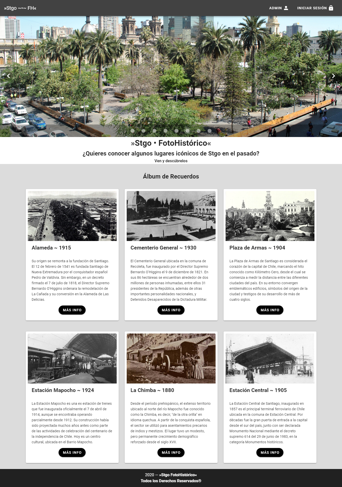
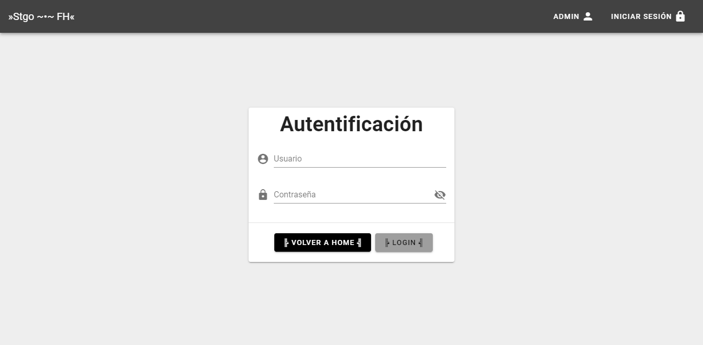
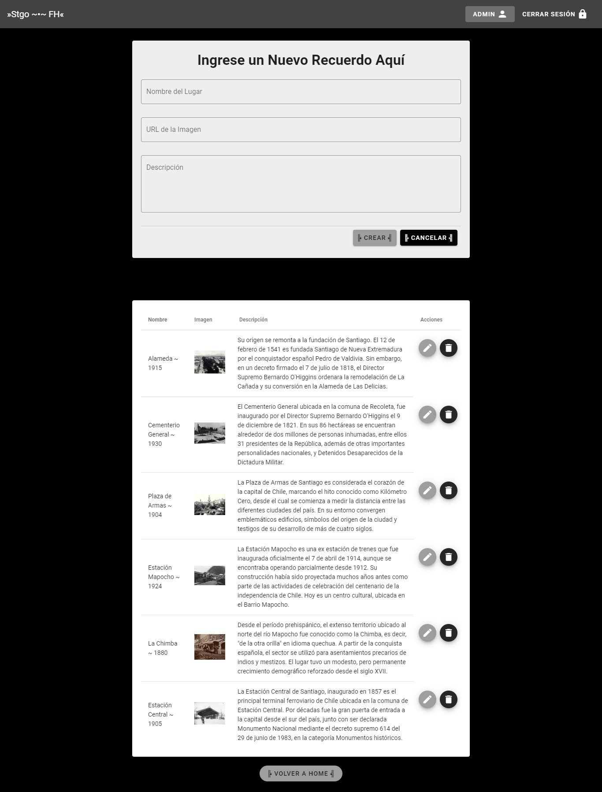

# Santiago FotoHistórico

## Project Description

This work is about a page that sells japanese animation products. Its functionality is based on **Vue.js**, along with other components such as **Vue Router, VUEX, Firebase, and CSS style framework called Vuetify.**

To see other projects, you can go to the link https://github.com/Marifuse

_Keywords: Vue, Vue Router, VUEX, Firebase, Framework, Vuetify, CSS, JavaScript, HTML, Git, Repository._

## Page View

### Home Page



### Login



### Admin Page




## Project setup
```
npm install
```

### Compiles and hot-reloads for development
```
npm run serve
```

### Compiles and minifies for production
```
npm run build
```

### Firebase Deploy Hosting
```
firebase deploy --only hosting
```

### Firebase Deploy Functions
```
firebase deploy --only functions
```

### Run Firebase (init)
```
firebase init
```

### Lints and fixes files
```
npm run lint
```

## Link Deploy Hosting

[Stgo FotoHistórico](https://chilefotos-d4ddd.web.app).

### Customize configuration
See [Configuration Reference](https://cli.vuejs.org/config/).

**_María Jesús Fuenzalida S._**

###### July 2020